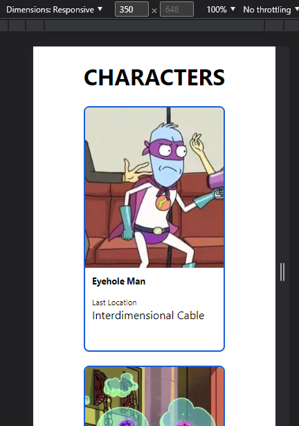
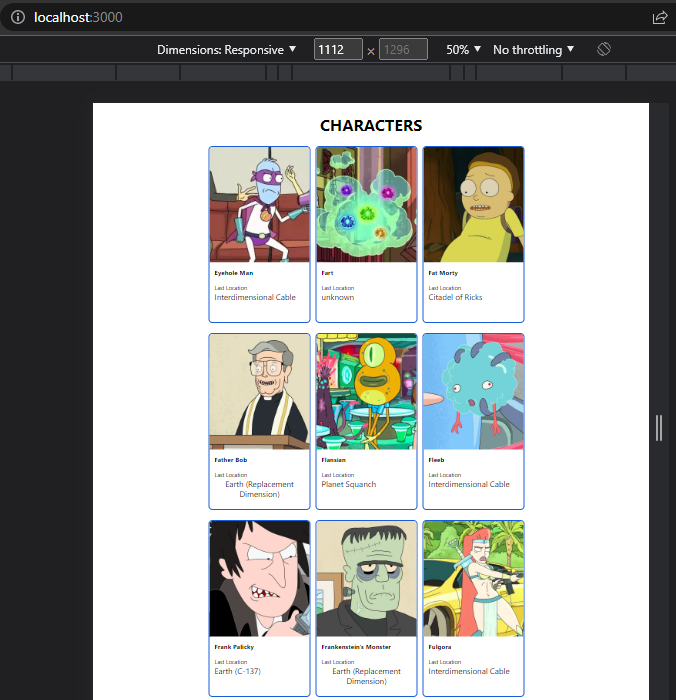

## Make It Real - Challenge

# Rick and Morty characters with react

This is a solution to the sixth project of the Make It Real course.

## Table of contents

- [Rick and Morty characters with react](#rick-and-morty-characters-with-react)
  - [Table of contents](#table-of-contents)
  - [Overview](#overview)
    - [The challenge](#the-challenge)
    - [Screenshot](#screenshot)
  - [My process](#my-process)
    - [Built with](#built-with)
    - [What I learned](#what-i-learned)
      - [**_Using Axios Library + useEffect and useState:_**](#using-axios-library--useeffect-and-usestate)
      - [**_Map() method and Component Props:_**](#map-method-and-component-props)
    - [Continued development](#continued-development)
    - [Useful resources](#useful-resources)
  - [Author](#author)
  - [Acknowledgments](#acknowledgments)

## Overview

### The challenge

In this challenge we have developed a mini web application in react by getting data from an external API and creating a charaters card grid layout.

Come have and a look at our Rick and Morty cards.

- Reusable components.
- React.
- Axios library.

### Screenshot




## My process

### Built with

- React
- Axios
- Flexbox & Grid
- CSS custom properties

### What I learned

We learned how to use Axios library to fetch data from an external API. Then we learned how to use useState and useEffect hooks to save that data into a local variable (an object). Eventually, the map() method showed up to make the code more readable and card components reusable from the characters' data array.

We also used props to send custom information to are card component to allow it to be reusable and display different information for the characters on the screen.

Finally, we put Flex into action to help us style our webpage.

#### **_Using Axios Library + useEffect and useState:_**

```js
const [characters, setCharacters] = useState([]);

useEffect(() => {
  axios
    .get("https://rickandmortyapi.com/api/character/?page=7")
    .then((response) => {
      setCharacters(response.data.results);
    });
}, []);
```

#### **_Map() method and Component Props:_**

```js
const displayCharacters = characters
  .filter((elem, ind) => ind < 20)
  .map((item, index) => {
    return (
      <div key={item.id}>
        <CharacterCard
          url={item.image}
          name={item.name}
          location={item.location.name}
        />
      </div>
    );
  });
```

### Continued development

The next step will be to try to include all the props in a single object. That will make the App.js code shorter and probably more readable and coherent.

It will be nice also to allow: random card generation, a selectable amount of cards displayed, and more interaction with the user inputs.

Some embellishments style properties will do the final trick for visual engagement.

### Useful resources

- [React: props concept](https://youtu.be/bMknfKXIFA8?t=14411) - In deep and straightforward look into React.
- [Axios](https://youtu.be/uxsEZgkcvFU) - Useful Axios tutorial (also in spanish).

## Author

- github - [Laura Esmoris](https://github.com/)
- github - [Ivan Cabulo](https://github.com/icabulo)

## Acknowledgments

Nice help from out mentors. Sergio and Daniel.
